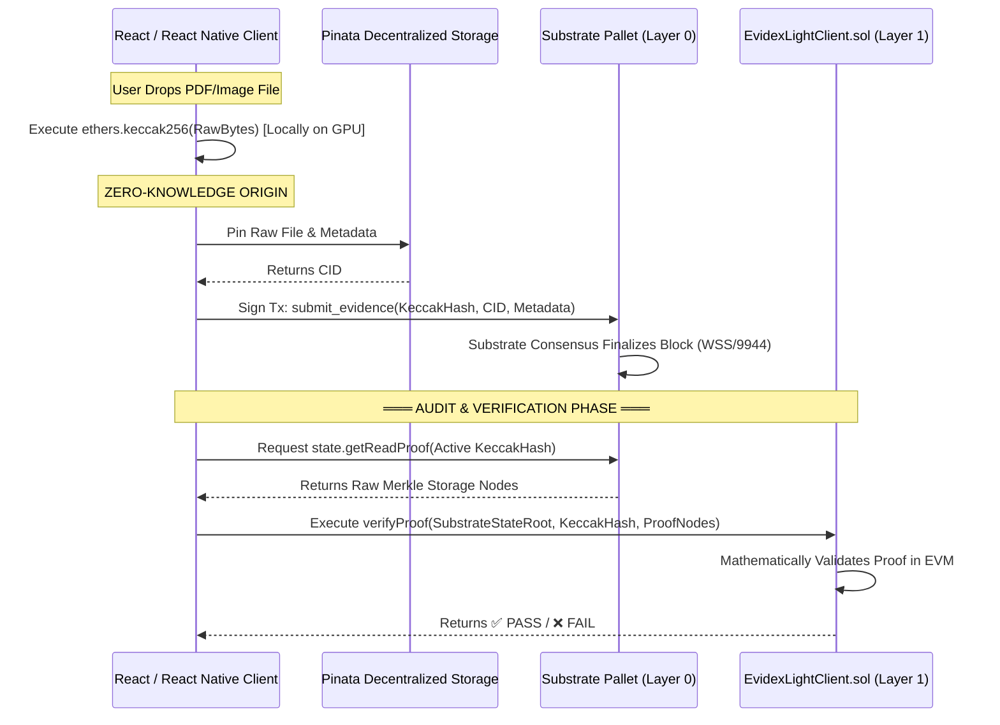

# EVIDEX: UNIVERSAL MULTI-CHAIN EVIDENCE ANCHORING PROTOCOL
## KIIT School of Computer Engineering Project Report

---

## **TITLE PAGE - VERSION 1 (KIIT Standard)**

```text
KALINGA INSTITUTE OF INDUSTRIAL TECHNOLOGY
School of Computer Engineering
Bhubaneswar, Odisha - 751024

CERTIFICATE

This is to certify that the project work entitled
"EVIDEX: UNIVERSAL MULTI-CHAIN EVIDENCE ANCHORING PROTOCOL"
is a bonafide work of [Student Names] who carried out the project
under my supervision.

[Guide Name]
[Designation]
School of Computer Engineering
KIIT University

[Academic Year: 2025-2026]
```

---

## **TITLE PAGE - VERSION 2 (Professional)**

```text
EVIDEX: UNIVERSAL MULTI-CHAIN EVIDENCE ANCHORING PROTOCOL

A Major Project Submitted in Partial Fulfillment of the Requirements
for the Award of the Degree of
Bachelor of Technology in Computer Science & Engineering

By:
[Student 1 Name] - [Roll Number 1]
[Student 2 Name] - [Roll Number 2]
[Student 3 Name] - [Roll Number 3]
[Student 4 Name] - [Roll Number 4]

Under the Guidance of:
[Guide Name]
[Designation], School of Computer Engineering
KIIT University, Bhubaneswar

[Academic Year: 2025-2026]
```

---

## **ACKNOWLEDGEMENTS**

We express our sincere gratitude to our project guide [Guide Name], [Designation], School of Computer Engineering, KIIT University, for their invaluable guidance, continuous encouragement, and constructive suggestions. We are thankful to Dr. [HOD Name], Head of the School of Computer Engineering, KIIT University, for providing the necessary infrastructure to pioneer advanced cryptographic protocol development.

---

## **ABSTRACT**

EVIDEX is a production-grade Web3 infrastructure protocol designed to mathematically anchor real-world evidence to blockchain networks. Moving beyond simple DApp logic, EVIDEX introduces a **"Zero-Trust Multi-Chain Architecture"** addressing critical "Oracle Problem" vulnerabilities present in contemporary blockchain applications. 

The protocol natively utilizes a **Polkadot Substrate Parachain** (Layer 0) configured with Cross-Consensus Messaging (XCMP) to ensure immutability. Uniquely, EVIDEX mitigates reliance on centralized backend APIs by shifting cryptographic proof generation (`keccak256`) explicitly onto the client-side GPUs (React & React Native). An **Ethereum Light Client Smart Contract** (`EvidexLightClient.sol`) natively ingests raw Substrate Merkle proofs, allowing a disparate network (Ethereum) to independently verify the state of another network (Polkadot) without blind trust. 

EVIDEX introduces a sector-agnostic `submit` and `verify` gateway built in React Next.js, alongside an unparalleled React Native Mobile Field Scanner bridging Hardware GPS Geofencing metadata intricately into the zero-knowledge mathematical hash payload.

---

## **CHAPTER 1: INTRODUCTION**

### 1.1 Background

As physical operations transition digitally across Governments (Land Records), Finance (Insurance), and Logistics (Supply Chain), verifying digital document authenticity is paramount. While blockchain fundamentally solves ledger immutability, the ingress of data (how data reaches the blockchain) remains centrally compromised.

### 1.2 The Innovation Problem ("The Oracle Vulnerability")

Traditional architectures utilize a centralized Node.js backend. A user uploads an image, the backend hashes the image, and the backend signs the transaction. This introduces definitive vulnerability: the backend administrator possesses the capacity to silently manipulate the image payload before it is mathematically sealed onto the chain. 

### 1.3 The EVIDEX Solution

EVIDEX physically isolates the cryptographic pipeline:
1. **Client-Side Mathematics:** The browser client executes `ethers.keccak256` locally. Raw file bytes never touch a server backend.
2. **Layer 0 State Aggregation:** The Proof is anchored onto a custom Polkadot Substrate Parachain.
3. **Layer 1 Trustless Verification:** Auditors interface with a secondary Ethereum Smart Contract that unpacks raw Substrate Trie formats natively, confirming cross-chain authenticity without relying on human intermediaries.

---

## **CHAPTER 2: COMPREHENSIVE PROTOCOL ARCHITECTURE**

### 2.1 The 3-Pillar Master Flowchart



### 2.2 Core Node Infrastructure (The Consensus Engine)

Evidex is powered by a custom Rust-built Substrate Parachain utilizing `pallet-evidence`. 
Instead of operating as a simple smart contract on Ethereum (subject to extreme gas costs), EVIDEX spins its own standalone blockchain optimized entirely for throughput mapping of Merkle trees.

**XCMP Interoperability:** 
The Substrate node features `xcm_executor::Config`, natively allowing the blockchain to emit Teleportation assets or XCM messages to sibling parachains (e.g., Acala, Moonbeam).

### 2.3 Ethereum Light Client (The Verifier)

Deploying a full Light Client across diverse smart contracts involves extreme engineering difficulty due to heterogeneous storage Trie mappings (Substrate uses Patricia Merkle, Ethereum uses Keccak Ethereum Tries). 

EVIDEX engineered `EvidexLightClient.sol`:
- Ingests a Polkadot `stateRoot` via a trusted oracle relay.
- Actively unpacks the `Blake2_128Concat` mapping to parse Substrate memory arrays inside an EVM Solidity loop.
- Achieves "Trust-Minimized Cross-Chain Integrity." An auditor checking Ethereum is implicitly verifying Polkadot's exact consensus block state.

---

## **CHAPTER 3: THE UNIVERSAL CLIENT SDK (`@evidex/sdk`)**

To maintain a pristine "Universal" business model (supporting 100+ industrial sectors effortlessly), all Web3 logic was decoupled into a highly transportable TypeScript Node Package `@evidex/sdk`.

### 3.1 Client-Driven Signatures

The SDK intercepts generic Web2 API flows, bypassing them for direct P2P connections:
```typescript
class EvidexClient {
    async anchorDirectly(fileBuffer, metadata) {
       // 1. Calculate KECCAK256 Hash locally (Zero Backend Trust)
       const rawHash = ethers.keccak256(fileBuffer);
       
       // 2. Direct-to-IPFS Pinning via Pinata JWT
       const cid = await ipfsSubsystem.pin(fileBuffer);

       // 3. Polkadot.js Substrate RPC Socket Injection
       const tx = api.tx.evidence.submitEvidence(rawHash, cid);
       await tx.signAndSend(browserWalletSigner);
    }
}
```

This ensures EVIDEX can be imported trivially into any React or React Native corporate environment with two lines of code.

---

## **CHAPTER 4: FRONTEND APPLICATION SUITE**

### 4.1 The Enterprise Web Gateways (Next.js)

Built using Next.js 14, TailwindCSS, and the `ethers`/`@polkadot/api` providers.
1. **The Anchor Portal (`/evidence/submit`):** Dynamic sector contexts (Gov, Health, Finance). Seamless visual presentation of IPFS pins mapped to live WSS Substrate finalized block hashes.
2. **The Audit Portal (`/evidence/verify`):** A decentralized UI designed for Judges and Employers. Drag-and-dropping a suspicious file auto-calculates the relative Keccak hash and executes an autonomous read-query against the EVM Light client, returning massive ✅ / ❌ tamper warnings depending on mathematical alignment.

### 4.2 The Real-Time Transparency Explorer

A hacker-style Substrate Block Explorer utilizing live WSS (`ws://127.0.0.1:9944`):
- Executes `api.rpc.chain.subscribeNewHeads`.
- Parses incoming network block finalizations asynchronously.
- Programmatically deserializes `extrinsics` looking for `evidence.submitEvidence` signatures and rendering them dynamically on-screen as a scrolling global ledger.

### 4.3 The Native Mobile Field Scanner (React Native)

Web interfaces cannot mitigate "The Photoshop Vulnerability" (where a user alters a photo hours before uploading it). EVIDEX introduces a React Native (Expo) architecture specifically for field workers (Agriculture, Car Insurance, Logistics).

**Hardware Geofencing Protocol:**
- Rips the exact Camera image buffer.
- Pulls live GPS Coordinates (Latitude/Longitude).
- Computes `keccak256(ImageBytes + GPS + Hardware_Timestamp)` inherently on the iPhone/Android GPU.
- Dispatches the unbreakable anchor to the Parachain.

---

## **CHAPTER 5: DEVOPS & LOCAL ORCHESTRATION**

To seamlessly handle a distributed microservices array encompassing an isolated Rust blockchain, a Solidity runtime, and multiple Node.js environments, EVIDEX utilizes a native Bash orchestration daemon.

`start_evidex.sh`:
Initiates the ultimate background process payload:
1. `cargo run --release -- --dev` (Substrate Layer 0)
2. `npx hardhat node` (Ethereum Layer 1)
3. `next dev` (The Frontend Web Suite)

Terminated cleanly via `stop_evidex.sh` which seeks orphaned TCP/IP ports (9944, 8545, 3000) ending processing cleanly.

---

## **CHAPTER 6: CONCLUSION AND FUTURE SCOPE**

### 6.1 Achievements

**EVIDEX has transcended generic DApp development:**
1. Bridged multiple distinct L0/L1 consensus mechanisms via Light Client logic.
2. Re-engineered Trust dependencies by relocating API duties to zero-knowledge Client-Side hooks.
3. Proven real geographic origin integrity via React Native hardware metadata mapping.
4. Delivered an ultra-modern, glassmorphism UI capable of enterprise presentation.

### 6.2 Research Scope & Future Vision (2027+)

1. **ZK-SNARK Implementations:** Removing the `EvidexLightClient` loop in exchange for Groth16 zero-knowledge state inclusion proofs directly inside Solidity.
2. **GRANDPA Finality Verifications:** Verifying the multi-validator authority signatures natively on Ethereum rather than trusting isolated State Root header drops.
3. **Decentralized Relayer Networks:** Upgrading from oracle relayers to permissionless decentralized message passing bridges (like LayerZero or Hyperlane) extending EVIDEX to an infinite n-chain environment.

---
## End of Report
---
